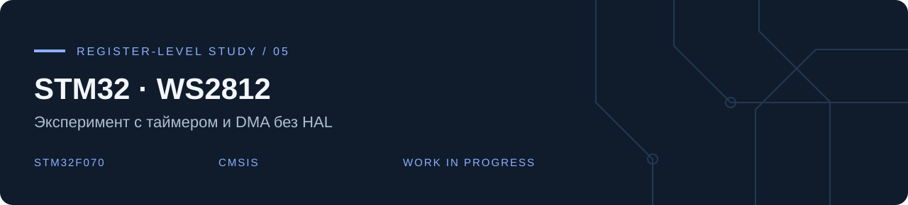

**Владислав Чернухин** · [Инженерное портфолио](https://github.com/TzarRusi)

Учебный эксперимент по управлению адресными светодиодами на **STM32F070CBTx** через регистры периферии и CMSIS, без HAL. Репозиторий показывает работу с RCC, GPIO, SysTick, TIM3 и DMA.

## Идея

Цвета кодируются в буфер длительностей импульсов. Таймер TIM3 формирует PWM на PA6 / TIM3_CH1, а DMA должен переносить значения из памяти в регистр сравнения таймера. В исходнике задан буфер для 8 светодиодов.

## Состав

- [`Src/main.c`](Src/main.c) — настройка периферии и логика примера.
- `CMSIS/` — заголовки и системный код.
- `Startup/` и `STM32F070CBTX_FLASH.ld` — стартовый код и linker script.
- `.project` / `.cproject` — конфигурация проекта IDE.

## Статус: требует доработки

Текущая версия — экспериментальная заготовка, не проверенный готовый драйвер. Статический просмотр выявляет конкретные задачи:

1. В `update_ws2812()` не задано число передач `CNDTR`.
2. Присваивание `DMA1_Channel4->CCR = DMA_CCR_EN` затирает ранее заданную конфигурацию DMA.
3. Необходимо сверить DMA mapping и тайминги с документацией MCU и конкретной ленты.
4. Проверить порядок компонент цвета, reset interval, ожидание окончания передачи и конфигурацию скорости GPIO.

Сборка и измерение формы сигнала в рамках оформления портфолио не выполнялись. Исходная прошивка не изменялась.
